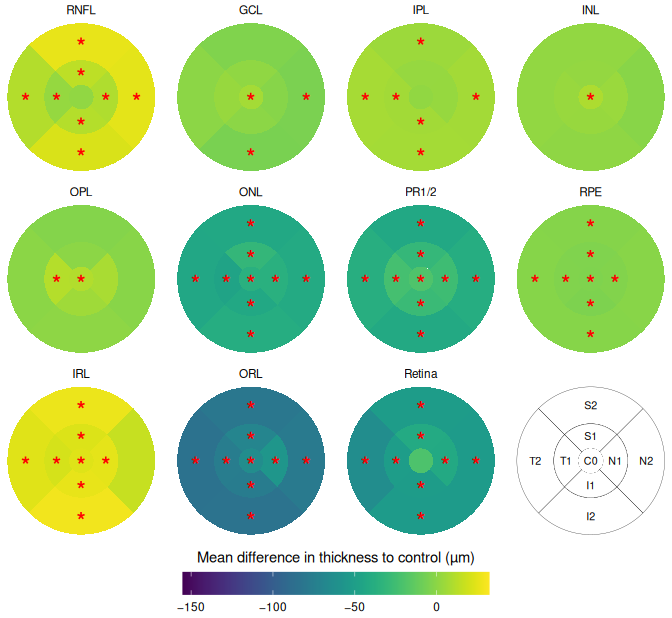
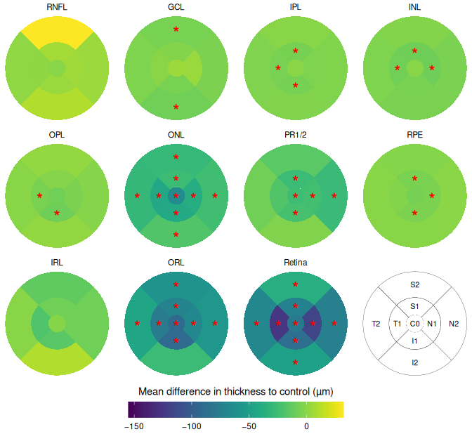
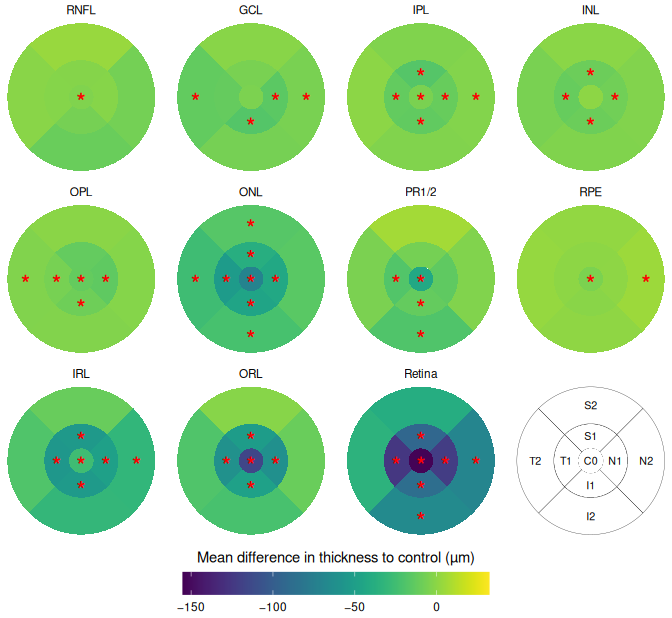
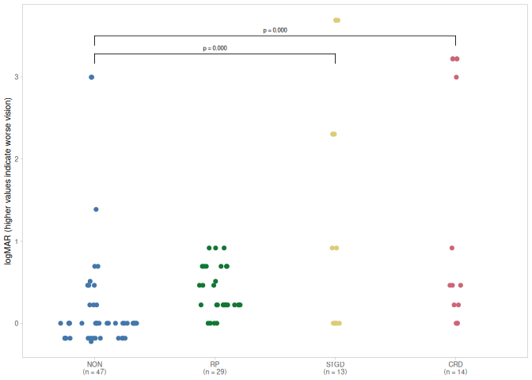
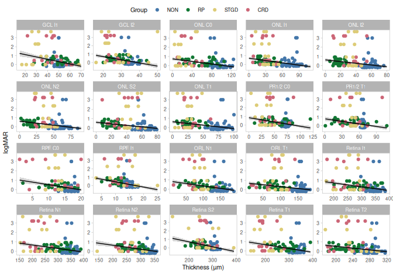

# Summary

This script reproduces the essential parts of the analysis presented in [@Gersch2022] on a
mock data set. Consequently, **the results are purely random!**

While the general rationale of the analysis was validated by peer-review, please note
that the script itself was not reviewed. The script is provided under an
[Apache license 2.0](https://www.apache.org/licenses/LICENSE-2.0.txt).

Please cite as [].

# Dataset

The here provided data set was randomly generated based on the case numbers, means and
standard deviations by disease entity, layer and segment in the original paper. For
details about layer and segment definition please see [@Gersch2022].


# Interocular symmetry

Multivariate assessment of interocular symmetry by PCA and euclidean distance.


The ANOVA suggests that:

  - The main effect of disease is statistically significant and large (F(3, 54) =
194.92, p < .001; Eta2 = 0.92, 95% CI [0.88, 1.00])

Effect sizes were labelled following Field's (2013) recommendations.


Table: Dunnett pairwise comparisons among groups. The different group sizes should be accounted for in the interpretation.

|contrast   | estimate|        SE| df|  t.ratio| p.value|
|:----------|--------:|---------:|--:|--------:|-------:|
|RP - NON   | 5.559057| 0.2627113| 54| 21.16033|       0|
|STGD - NON | 4.847748| 0.3542398| 54| 13.68493|       0|
|CRD - NON  | 5.203080| 0.3542398| 54| 14.68802|       0|

# Alterations of the retinal structure in IRDs

## Retinitis pigmentosa


<div class="Rtable1"><table class="Rtable1">
<thead>
<tr>
<th class='rowlabel firstrow lastrow'></th>
<th class='firstrow lastrow'><span class='stratlabel'>NON<br><span class='stratn'>(N=16)</span></span></th>
<th class='firstrow lastrow'><span class='stratlabel'>RP<br><span class='stratn'>(N=16)</span></span></th>
</tr>
</thead>
<tbody>
<tr>
<td class='rowlabel firstrow'>age</td>
<td class='firstrow'></td>
<td class='firstrow'></td>
</tr>
<tr>
<td class='rowlabel'>Mean (SD)</td>
<td>36.7 (15.2)</td>
<td>36.8 (16.0)</td>
</tr>
<tr>
<td class='rowlabel lastrow'>Median [Min, Max]</td>
<td class='lastrow'>38.3 [8.86, 56.8]</td>
<td class='lastrow'>38.9 [7.40, 62.7]</td>
</tr>
<tr>
<td class='rowlabel firstrow'>sex</td>
<td class='firstrow'></td>
<td class='firstrow'></td>
</tr>
<tr>
<td class='rowlabel'>f</td>
<td>8 (50.0%)</td>
<td>8 (50.0%)</td>
</tr>
<tr>
<td class='rowlabel lastrow'>m</td>
<td class='lastrow'>8 (50.0%)</td>
<td class='lastrow'>8 (50.0%)</td>
</tr>
</tbody>
</table>
</div>


Table: Top 20 most significantly different segment thicknesses.

|layer  |segment | Coefficient|    SE|  CI_low| CI_high|       t| df_error|  p| adj.p|
|:------|:-------|-----------:|-----:|-------:|-------:|-------:|--------:|--:|-----:|
|ORL    |I2      |     -83.937| 2.287| -88.509| -79.366| -36.706|       62|  0|     0|
|ONL    |I2      |     -38.875| 1.430| -41.733| -36.017| -27.189|       62|  0|     0|
|ORL    |T2      |     -84.469| 3.176| -90.818| -78.119| -26.592|       62|  0|     0|
|ONL    |T2      |     -43.437| 1.666| -46.768| -40.107| -26.072|       62|  0|     0|
|ORL    |N2      |     -78.750| 3.030| -84.808| -72.692| -25.987|       62|  0|     0|
|ORL    |S2      |     -81.125| 3.147| -87.416| -74.834| -25.779|       62|  0|     0|
|PR1_2  |S2      |     -42.906| 1.665| -46.234| -39.578| -25.772|       62|  0|     0|
|PR1_2  |I2      |     -42.250| 1.887| -46.023| -38.477| -22.386|       62|  0|     0|
|ONL    |S2      |     -42.563| 2.017| -46.595| -38.530| -21.099|       62|  0|     0|
|ONL    |N2      |     -41.094| 1.967| -45.026| -37.162| -20.892|       62|  0|     0|
|PR1_2  |N2      |     -38.781| 2.029| -42.837| -34.725| -19.114|       62|  0|     0|
|ONL    |T1      |     -46.219| 2.619| -51.454| -40.984| -17.648|       62|  0|     0|
|ORL    |I1      |     -77.531| 4.720| -86.966| -68.097| -16.427|       62|  0|     0|
|ONL    |I1      |     -43.125| 2.704| -48.530| -37.720| -15.951|       62|  0|     0|
|ORL    |T1      |     -76.281| 5.228| -86.731| -65.831| -14.592|       62|  0|     0|
|PR1_2  |T2      |     -37.469| 2.640| -42.747| -32.191| -14.191|       62|  0|     0|
|ORL    |S1      |     -69.969| 5.062| -80.087| -59.851| -13.823|       62|  0|     0|
|RNFL   |S2      |      25.625| 2.140|  21.348|  29.902|  11.975|       62|  0|     0|
|Retina |T2      |     -64.062| 5.543| -75.143| -52.982| -11.557|       62|  0|     0|
|RNFL   |T2      |      11.000| 0.973|   9.055|  12.945|  11.304|       62|  0|     0|



## Cone-rods dystrophie


<div class="Rtable1"><table class="Rtable1">
<thead>
<tr>
<th class='rowlabel firstrow lastrow'></th>
<th class='firstrow lastrow'><span class='stratlabel'>NON<br><span class='stratn'>(N=7)</span></span></th>
<th class='firstrow lastrow'><span class='stratlabel'>CRD<br><span class='stratn'>(N=7)</span></span></th>
</tr>
</thead>
<tbody>
<tr>
<td class='rowlabel firstrow'>age</td>
<td class='firstrow'></td>
<td class='firstrow'></td>
</tr>
<tr>
<td class='rowlabel'>Mean (SD)</td>
<td>34.9 (11.9)</td>
<td>33.2 (10.3)</td>
</tr>
<tr>
<td class='rowlabel lastrow'>Median [Min, Max]</td>
<td class='lastrow'>34.7 [17.1, 54.2]</td>
<td class='lastrow'>34.1 [18.2, 49.0]</td>
</tr>
<tr>
<td class='rowlabel firstrow'>sex</td>
<td class='firstrow'></td>
<td class='firstrow'></td>
</tr>
<tr>
<td class='rowlabel'>f</td>
<td>3 (42.9%)</td>
<td>3 (42.9%)</td>
</tr>
<tr>
<td class='rowlabel lastrow'>m</td>
<td class='lastrow'>4 (57.1%)</td>
<td class='lastrow'>4 (57.1%)</td>
</tr>
</tbody>
</table>
</div>


Table: Top 20 most significantly different segment thicknesses.

|layer  |segment | Coefficient|     SE|   CI_low|  CI_high|       t| df_error|  p| adj.p|
|:------|:-------|-----------:|------:|--------:|--------:|-------:|--------:|--:|-----:|
|Retina |N1      |    -116.643|  7.110| -131.257| -102.028| -16.406|       26|  0|     0|
|Retina |T1      |    -125.786|  9.128| -144.550| -107.022| -13.779|       26|  0|     0|
|ONL    |C0      |     -66.500|  5.310|  -77.414|  -55.586| -12.525|       26|  0|     0|
|IPL    |I1      |      -7.000|  0.581|   -8.194|   -5.806| -12.053|       26|  0|     0|
|ONL    |T2      |     -30.286|  2.603|  -35.635|  -24.936| -11.637|       26|  0|     0|
|ORL    |I1      |     -90.714|  8.039| -107.239|  -74.190| -11.284|       26|  0|     0|
|ONL    |T1      |     -42.714|  3.923|  -50.779|  -34.650| -10.887|       26|  0|     0|
|ORL    |N1      |     -67.714|  6.993|  -82.089|  -53.340|  -9.683|       26|  0|     0|
|INL    |T1      |      -8.429|  0.979|  -10.440|   -6.417|  -8.612|       26|  0|     0|
|Retina |N2      |     -74.429|  9.178|  -93.293|  -55.564|  -8.110|       26|  0|     0|
|ONL    |N1      |     -39.357|  5.047|  -49.731|  -28.983|  -7.798|       26|  0|     0|
|INL    |N1      |      -9.071|  1.186|  -11.510|   -6.633|  -7.647|       26|  0|     0|
|RPE    |N1      |      -4.929|  0.648|   -6.260|   -3.597|  -7.610|       26|  0|     0|
|ORL    |S2      |     -59.286|  7.867|  -75.457|  -43.115|  -7.536|       26|  0|     0|
|Retina |I1      |     -88.286| 11.826| -112.595|  -63.976|  -7.465|       26|  0|     0|
|ONL    |I1      |     -41.786|  5.607|  -53.311|  -30.261|  -7.453|       26|  0|     0|
|Retina |T2      |     -67.571|  9.529|  -87.158|  -47.985|  -7.091|       26|  0|     0|
|IPL    |T1      |      -5.929|  0.858|   -7.693|   -4.165|  -6.909|       26|  0|     0|
|GCL    |I2      |      -8.214|  1.226|  -10.735|   -5.694|  -6.699|       26|  0|     0|
|ORL    |C0      |     -91.429| 13.711| -119.612|  -63.245|  -6.668|       26|  0|     0|



## Morbus Stargard


<div class="Rtable1"><table class="Rtable1">
<thead>
<tr>
<th class='rowlabel firstrow lastrow'></th>
<th class='firstrow lastrow'><span class='stratlabel'>NON<br><span class='stratn'>(N=7)</span></span></th>
<th class='firstrow lastrow'><span class='stratlabel'>STGD<br><span class='stratn'>(N=7)</span></span></th>
</tr>
</thead>
<tbody>
<tr>
<td class='rowlabel firstrow'>age</td>
<td class='firstrow'></td>
<td class='firstrow'></td>
</tr>
<tr>
<td class='rowlabel'>Mean (SD)</td>
<td>40.1 (17.8)</td>
<td>39.6 (16.8)</td>
</tr>
<tr>
<td class='rowlabel lastrow'>Median [Min, Max]</td>
<td class='lastrow'>35.7 [17.1, 70.9]</td>
<td class='lastrow'>34.3 [14.1, 68.0]</td>
</tr>
<tr>
<td class='rowlabel firstrow'>sex</td>
<td class='firstrow'></td>
<td class='firstrow'></td>
</tr>
<tr>
<td class='rowlabel'>f</td>
<td>5 (71.4%)</td>
<td>5 (71.4%)</td>
</tr>
<tr>
<td class='rowlabel lastrow'>m</td>
<td class='lastrow'>2 (28.6%)</td>
<td class='lastrow'>2 (28.6%)</td>
</tr>
</tbody>
</table>
</div>


Table: Top 20 most significantly different segment thicknesses.

|layer  |segment | Coefficient|     SE|   CI_low|  CI_high|       t| df_error|  p| adj.p|
|:------|:-------|-----------:|------:|--------:|--------:|-------:|--------:|--:|-----:|
|ONL    |C0      |     -71.714|  3.367|  -78.636|  -64.793| -21.298|       26|  0|     0|
|ORL    |C0      |    -116.214|  7.405| -131.435| -100.994| -15.694|       26|  0|     0|
|Retina |C0      |    -154.071| 10.365| -175.376| -132.767| -14.865|       26|  0|     0|
|PR1_2  |C0      |     -42.571|  3.669|  -50.113|  -35.030| -11.603|       26|  0|     0|
|ONL    |N1      |     -42.500|  3.814|  -50.340|  -34.660| -11.143|       26|  0|     0|
|ONL    |T1      |     -53.143|  5.037|  -63.497|  -42.789| -10.550|       26|  0|     0|
|ORL    |I1      |     -48.714|  5.217|  -59.438|  -37.991|  -9.338|       26|  0|     0|
|ORL    |T1      |     -61.071|  6.660|  -74.761|  -47.382|  -9.170|       26|  0|     0|
|PR1_2  |T1      |     -18.714|  2.063|  -22.956|  -14.473|  -9.070|       26|  0|     0|
|ORL    |N1      |     -62.000|  6.937|  -76.260|  -47.740|  -8.937|       26|  0|     0|
|ONL    |I1      |     -45.643|  5.202|  -56.335|  -34.951|  -8.775|       26|  0|     0|
|Retina |T1      |    -125.786| 14.350| -155.283|  -96.289|  -8.766|       26|  0|     0|
|IPL    |I1      |     -13.286|  1.524|  -16.418|  -10.153|  -8.718|       26|  0|     0|
|Retina |N1      |    -121.857| 14.071| -150.780|  -92.934|  -8.660|       26|  0|     0|
|RPE    |C0      |      -4.857|  0.601|   -6.092|   -3.622|  -8.082|       26|  0|     0|
|IRL    |T1      |     -55.857|  6.932|  -70.105|  -41.609|  -8.058|       26|  0|     0|
|ONL    |I2      |     -22.571|  2.839|  -28.406|  -16.736|  -7.951|       26|  0|     0|
|IPL    |S1      |     -17.500|  2.345|  -22.320|  -12.680|  -7.464|       26|  0|     0|
|ORL    |S1      |     -52.143|  7.436|  -67.428|  -36.858|  -7.012|       26|  0|     0|
|ONL    |T2      |     -25.857|  3.713|  -33.490|  -18.224|  -6.963|       26|  0|     0|



# Association between subfield thicknesses and visual function


<div class="Rtable1"><table class="Rtable1">
<thead>
<tr>
<th class='rowlabel firstrow lastrow'></th>
<th class='firstrow lastrow'><span class='stratlabel'>NON<br><span class='stratn'>(N=47)</span></span></th>
<th class='firstrow lastrow'><span class='stratlabel'>RP<br><span class='stratn'>(N=29)</span></span></th>
<th class='firstrow lastrow'><span class='stratlabel'>STGD<br><span class='stratn'>(N=13)</span></span></th>
<th class='firstrow lastrow'><span class='stratlabel'>CRD<br><span class='stratn'>(N=14)</span></span></th>
</tr>
</thead>
<tbody>
<tr>
<td class='rowlabel firstrow'>logMAR</td>
<td class='firstrow'></td>
<td class='firstrow'></td>
<td class='firstrow'></td>
<td class='firstrow'></td>
</tr>
<tr>
<td class='rowlabel'>Mean (SD)</td>
<td>0.186 (0.671)</td>
<td>0.396 (0.290)</td>
<td>1.52 (1.53)</td>
<td>1.33 (1.45)</td>
</tr>
<tr>
<td class='rowlabel lastrow'>Median [Min, Max]</td>
<td class='lastrow'>0 [-0.223, 3.00]</td>
<td class='lastrow'>0.223 [0, 0.916]</td>
<td class='lastrow'>0.916 [0, 3.69]</td>
<td class='lastrow'>0.462 [0, 3.22]</td>
</tr>
<tr>
<td class='rowlabel firstrow'>age</td>
<td class='firstrow'></td>
<td class='firstrow'></td>
<td class='firstrow'></td>
<td class='firstrow'></td>
</tr>
<tr>
<td class='rowlabel'>Mean (SD)</td>
<td>36.0 (16.2)</td>
<td>36.9 (16.4)</td>
<td>40.1 (16.7)</td>
<td>33.2 (9.89)</td>
</tr>
<tr>
<td class='rowlabel lastrow'>Median [Min, Max]</td>
<td class='lastrow'>34.7 [8.86, 70.9]</td>
<td class='lastrow'>39.1 [7.40, 62.7]</td>
<td class='lastrow'>34.3 [14.1, 68.0]</td>
<td class='lastrow'>34.1 [18.2, 49.0]</td>
</tr>
<tr>
<td class='rowlabel firstrow'>sex</td>
<td class='firstrow'></td>
<td class='firstrow'></td>
<td class='firstrow'></td>
<td class='firstrow'></td>
</tr>
<tr>
<td class='rowlabel'>f</td>
<td>23 (48.9%)</td>
<td>16 (55.2%)</td>
<td>9 (69.2%)</td>
<td>6 (42.9%)</td>
</tr>
<tr>
<td class='rowlabel lastrow'>m</td>
<td class='lastrow'>24 (51.1%)</td>
<td class='lastrow'>13 (44.8%)</td>
<td class='lastrow'>4 (30.8%)</td>
<td class='lastrow'>8 (57.1%)</td>
</tr>
</tbody>
</table>
</div>

```
## 
## 	Kruskal-Wallis rank sum test
## 
## data:  vis_dat$logMAR and vis_dat$disease
## Kruskal-Wallis chi-squared = 30.19, df = 3, p-value = 1.259e-06
```

```
##                 z value   Pr(>|z|)    
## RP - NON == 0     3.989 0.00019705 ***
## STGD - NON == 0   3.818 0.00039773 ***
## CRD - NON == 0    3.990 0.00019630 ***
```

<!-- -->


Table: Top 20 segments most significantly associated with logMAR.

|layer  |segment | Coefficient|    SE| CI_low| CI_high|      t|  p| adj.p|
|:------|:-------|-----------:|-----:|------:|-------:|------:|--:|-----:|
|RPE    |I1      |      -0.063| 0.010| -0.083|  -0.043| -6.157|  0| 0.000|
|Retina |T1      |      -0.004| 0.001| -0.005|  -0.003| -6.002|  0| 0.000|
|ONL    |I1      |      -0.009| 0.001| -0.012|  -0.006| -5.792|  0| 0.000|
|ONL    |C0      |      -0.007| 0.001| -0.009|  -0.005| -5.741|  0| 0.000|
|Retina |S2      |      -0.006| 0.001| -0.008|  -0.004| -5.639|  0| 0.000|
|GCL    |I2      |      -0.038| 0.007| -0.051|  -0.024| -5.414|  0| 0.000|
|GCL    |I1      |      -0.026| 0.005| -0.036|  -0.016| -5.300|  0| 0.000|
|ORL    |N1      |      -0.005| 0.001| -0.007|  -0.003| -5.252|  0| 0.000|
|Retina |N1      |      -0.004| 0.001| -0.005|  -0.002| -5.149|  0| 0.000|
|PR1_2  |C0      |      -0.010| 0.002| -0.014|  -0.006| -5.040|  0| 0.000|
|ONL    |N2      |      -0.009| 0.002| -0.012|  -0.005| -5.020|  0| 0.000|
|Retina |I1      |      -0.004| 0.001| -0.006|  -0.002| -5.008|  0| 0.000|
|ONL    |T1      |      -0.007| 0.001| -0.010|  -0.004| -4.925|  0| 0.000|
|ONL    |S2      |      -0.008| 0.002| -0.011|  -0.005| -4.908|  0| 0.000|
|RPE    |C0      |      -0.055| 0.011| -0.077|  -0.032| -4.790|  0| 0.000|
|Retina |T2      |      -0.005| 0.001| -0.007|  -0.003| -4.760|  0| 0.000|
|ORL    |T1      |      -0.004| 0.001| -0.006|  -0.002| -4.615|  0| 0.000|
|Retina |N2      |      -0.004| 0.001| -0.006|  -0.002| -4.531|  0| 0.000|
|PR1_2  |T1      |      -0.010| 0.002| -0.014|  -0.005| -4.521|  0| 0.000|
|ONL    |I2      |      -0.009| 0.002| -0.013|  -0.005| -4.497|  0| 0.001|



# Licence

Copyright 2023 Julien Delarocque
 
Licensed under the Apache License, Version 2.0 (the "License"); you may not use this file
except in compliance with the License. You may obtain a copy of the License at
http://www.apache.org/licenses/LICENSE-2.0
 
Unless required by applicable law or agreed to in writing, software distributed under the
License is distributed on an "AS IS" BASIS, WITHOUT WARRANTIES OR CONDITIONS OF ANY KIND,
either express or implied. See the License for the specific language governing
permissions and limitations under the License.

# References

<div id="ref-Gersch2022" class="csl-entry">
Gersch, Julia, Katerina Hufendiek, Julien Delarocque, Carsten Framme, Christina Jacobsen,
Heidi Stöhr, Ulrich Kellner, and Karsten Hufendiek. 2022. <span>“Investigation of
Structural Alterations in Inherited Retinal Diseases: A Quantitative SD-OCT-Analysis of
Retinal Layer Thicknesses in Light of Underlying Genetic Mutations.”</span>
<em>International Journal of Molecular Sciences</em> 23 (24): 16007.
<a href="https://doi.org/10.3390/ijms232416007">https://doi.org/10.3390/ijms232416007</a>.
</div>

# Session information

**R version 4.2.2 (2022-10-31)**

**Platform:** x86_64-pc-linux-gnu (64-bit) 

**locale:**
_LC_CTYPE=fr_FR.UTF-8_, _LC_NUMERIC=C_, _LC_TIME=fr_FR.UTF-8_, _LC_COLLATE=fr_FR.UTF-8_, _LC_MONETARY=fr_FR.UTF-8_, _LC_MESSAGES=fr_FR.UTF-8_, _LC_PAPER=fr_FR.UTF-8_, _LC_NAME=C_, _LC_ADDRESS=C_, _LC_TELEPHONE=C_, _LC_MEASUREMENT=fr_FR.UTF-8_ and _LC_IDENTIFICATION=C_

**attached base packages:** 
_stats_, _graphics_, _grDevices_, _utils_, _datasets_, _methods_ and _base_

**other attached packages:** 
_robustlmm(v.3.1-2)_, _lme4(v.1.1-31)_, _Matrix(v.1.5-3)_, _table1(v.1.4.3)_, _patchwork(v.1.1.2)_, _ggpubr(v.0.5.0)_, _forcats(v.0.5.2)_, _stringr(v.1.5.0)_, _dplyr(v.1.0.10)_, _purrr(v.1.0.1)_, _readr(v.2.1.3)_, _tidyr(v.1.2.1)_, _tibble(v.3.1.8)_, _ggplot2(v.3.4.0)_ and _tidyverse(v.1.3.2)_

**loaded via a namespace (and not attached):** 
_TH.data(v.1.1-1)_, _googledrive(v.2.0.0)_, _minqa(v.1.2.5)_, _colorspace(v.2.1-0)_, _ggsignif(v.0.6.4)_, _ellipsis(v.0.3.2)_, _estimability(v.1.4.1)_, _parameters(v.0.20.1)_, _fs(v.1.6.0)_, _report(v.0.5.5)_, _rstudioapi(v.0.14)_, _farver(v.2.1.1)_, _signs(v.0.1.2.9000)_, _fansi(v.1.0.4)_, _mvtnorm(v.1.1-3)_, _lubridate(v.1.9.0)_, _xml2(v.1.3.3)_, _codetools(v.0.2-18)_, _splines(v.4.2.2)_, _robustbase(v.0.95-0)_, _cachem(v.1.0.6)_, _knitr(v.1.41)_, _SuppDists(v.1.1-9.7)_, _polyclip(v.1.10-4)_, _Formula(v.1.2-4)_, _jsonlite(v.1.8.4)_, _nloptr(v.2.0.3)_, _broom(v.1.0.2)_, _Rmpfr(v.0.9-0)_, _dbplyr(v.2.3.0)_, _ggforce(v.0.4.1)_, _effectsize(v.0.8.2)_, _compiler(v.4.2.2)_, _httr(v.1.4.4)_, _PMCMRplus(v.1.9.6)_, _emmeans(v.1.8.4-1)_, _backports(v.1.4.1)_, _assertthat(v.0.2.1)_, _fastmap(v.1.1.0)_, _gargle(v.1.2.1)_, _cli(v.3.6.0)_, _tweenr(v.2.0.2)_, _htmltools(v.0.5.4)_, _tools(v.4.2.2)_, _gmp(v.0.6-10)_, _coda(v.0.19-4)_, _gtable(v.0.3.1)_, _glue(v.1.6.2)_, _ggthemes(v.4.2.4)_, _optmatch(v.0.10.5)_, _Rcpp(v.1.0.10)_, _carData(v.3.0-5)_, _cellranger(v.1.1.0)_, _jquerylib(v.0.1.4)_, _vctrs(v.0.5.2)_, _nlme(v.3.1-161)_, _insight(v.0.18.8)_, _xfun(v.0.36)_, _openxlsx(v.4.2.5.1)_, _rvest(v.1.0.3)_, _timechange(v.0.2.0)_, _lifecycle(v.1.0.3)_, _rstatix(v.0.7.1)_, _googlesheets4(v.1.0.1)_, _DEoptimR(v.1.0-11)_, _MASS(v.7.3-58.2)_, _zoo(v.1.8-11)_, _scales(v.1.2.1)_, _rlemon(v.0.2.0)_, _hms(v.1.1.2)_, _sandwich(v.3.0-2)_, _yaml(v.2.3.7)_, _memoise(v.2.0.1)_, _gridExtra(v.2.3)_, _pander(v.0.6.5)_, _sass(v.0.4.4)_, _fastGHQuad(v.1.0.1)_, _stringi(v.1.7.12)_, _highr(v.0.10)_, _bayestestR(v.0.13.0)_, _boot(v.1.3-28.1)_, _zip(v.2.2.2)_, _rlang(v.1.0.6)_, _pkgconfig(v.2.0.3)_, _evaluate(v.0.20)_, _lattice(v.0.20-45)_, _labeling(v.0.4.2)_, _tidyselect(v.1.2.0)_, _magrittr(v.2.0.3)_, _R6(v.2.5.1)_, _multcompView(v.0.1-8)_, _generics(v.0.1.3)_, _BWStest(v.0.2.2)_, _multcomp(v.1.4-20)_, _DBI(v.1.1.3)_, _pillar(v.1.8.1)_, _haven(v.2.5.1)_, _withr(v.2.5.0)_, _survival(v.3.5-0)_, _datawizard(v.0.6.5)_, _abind(v.1.4-5)_, _modelr(v.0.1.10)_, _crayon(v.1.5.2)_, _car(v.3.1-1)_, _utf8(v.1.2.2)_, _tzdb(v.0.3.0)_, _rmarkdown(v.2.20)_, _kSamples(v.1.2-9)_, _viridis(v.0.6.2)_, _grid(v.4.2.2)_, _readxl(v.1.4.1)_, _reprex(v.2.0.2)_, _digest(v.0.6.31)_, _xtable(v.1.8-4)_, _munsell(v.0.5.0)_, _viridisLite(v.0.4.1)_ and _bslib(v.0.4.2)_
